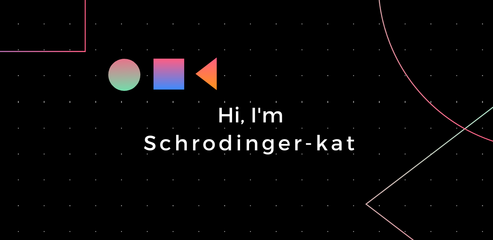

 

Congratulations! You have find a new way to stalk me, .

Since you're already here, find me on:   

<h2>🙋‍♂️ konnichiwa! , I'm Jishnn Tp. </h2>

- <i>Currently:</i> Senior Full Stack Software Engineer at  
- <i>Previously:</i> Cloud Application Developer at 

<h2>💻 I'm Currently working on:</h2>

- building OpenWeaver  application.
    - in Spring (Boot, Cloud, Google Cloud, Data) frameworks.

<h2>🎯 Skills in my arsenal:</h2>
                   

> exactly in that order ;)

## &#x1f4c8; GitHub Stats

💞️ I’m looking foward to collaborate on open source projects.

📫 You can reach me via 📧 [here ](mailto:jishnu.tp@proton.me?subject=[GitHub]) or 💬 [ping me here!](https://api.whatsapp.com/send?phone=918111855276&text=Hi,Ishin!)
